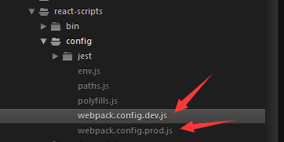

# React-Antd-admin
### [点我预览](https://whrweb.github.io/React-Antd-admin/index.html)

## 介绍
-   基于[react](https://github.com/facebook/react)，[ant-design](https://github.com/ant-design/ant-design) 后台管理系统纯净版
-   基于Antd UI 设计语言，可按需引入模块
-   浅度响应式设计
-   动态加载路由对应内容组件js文件

## 开发构建

### 目录结构
```bash
├── /dist/           # 项目输出目录
├── /public/         # 
| └── index.html     
├── /src/            # 项目源码目录
│ ├── /components/   # UI组件及UI相关方法
│ │ ├── Header.js     # 跨域请求
│ │ └── Menu.js      # 左侧菜单组件
│ ├── /models/       # 数据模型
│ ├── /common/       # 通用函数
│ │ ├── jsonp.js     # 跨域请求
│ │ └── utils.js     # 工具函数
│ ├── routes.js      # 路由配置
│ ├── app.js         # 整体布局控制
│ ├── index.less     # index样式文件
│ └──index.js        # 入口文件
├── package.json     # 项目信息
└── proxy.config.js  # 数据mock配置
```

文件命名说明:

-   components：组件（方法）为单位以文件夹保存，文件夹名组件首字母大写，方法首字母小写,文件夹内主文件与文件夹同名，多文件以`index.js`导出对象

### 快速开始

安装依赖

    npm install 或者 yarn install
    
开发

```bash
npm start    

打开 http://localhost:3000
```


构建：

```bash
npm run build

将会生成dist目录
```
    


## 其他
- 修改了安装目录下，react-scripts文件夹中的 webpack.config.dev.js 和 webpack.config.prod.js,(看下图),达到使用import引入antd模块，即可同时引入antd对应模块的组件和样式文件。另，可通过修改安装目录下antd/lib文件夹下对应的文件，完成自定义样式的需求。


